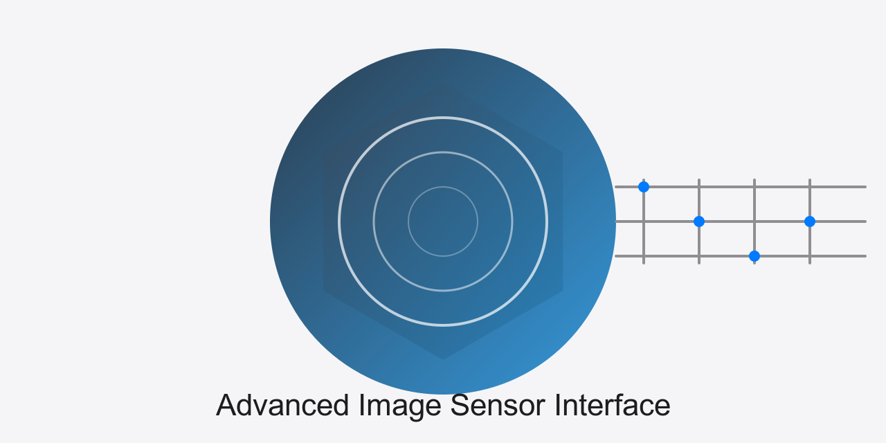
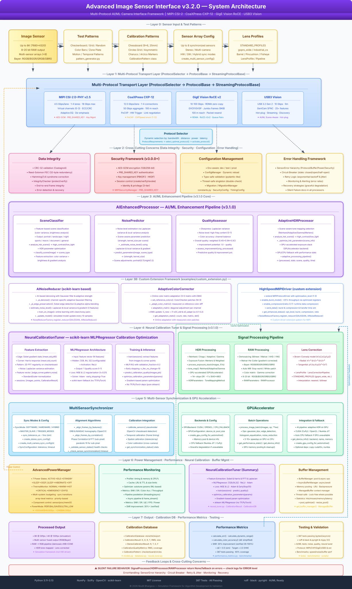

<div align="center">

# Advanced Image Sensor Interface



[](https://www.python.org/)

[](https://github.com/muditbhargava66/Advanced-Image-Sensor-Interface/actions/workflows/github-code-scanning/codeql)


[](https://github.com/psf/black)
[](https://github.com/astral-sh/ruff)
[](https://github.com/microsoft/pyright)
[](https://docs.pytest.org/)
[](https://advanced-image-sensor-interface.readthedocs.io/en/latest/?badge=latest)


</div>

## Overview

The Advanced Image Sensor Interface is a **comprehensive multi-protocol camera interface framework** supporting MIPI CSI-2, CoaXPress, GigE Vision, and USB3 Vision protocols with advanced image processing, multi-sensor synchronization, and professional-grade calibration capabilities. Version 3.2.0 introduces typed ProcessingResult objects for explicit error handling, configurable simulation delays across all protocol drivers, a 3D/Depth module for stereo disparity and point cloud generation, and Python 3.11+ security hardening.

### New in Version 3.2.0

- **Typed Processing Results**: `SignalProcessingResult`, `HDRProcessingResult`, `RAWProcessingResult`, and `LensCorrectionResult` dataclasses replace silent `None` returns with explicit success/error/metrics information
- **Configurable Simulation Delays**: `SimulationDelayConfig` gives per-driver control over simulated latencies in MIPI, GigE/RoCE, CoaXPress CXP-12, and USB3 drivers
- **3D/Depth Module**: `StereoDepthProcessor` with Block Matching and SGM-lite stereo disparity, disparity-to-depth conversion, point cloud generation, and PLY export
- **Python 3.11+ Required**: Security fixes for keras (deserialization, path traversal) and astropy (RCE) transitive dependencies
- **Security Hardening**: Dependency constraints updated for CVE-fixed versions; Python 3.10 support removed

### Version 3.1.0 Features (Retained)

- **AI/ML Integration**: Neural Calibration Tuner (scikit-learn MLPRegressor), SceneClassifier, NoisePredictor, QualityAssessor, AINoiseReducer, AdaptiveColorCorrector
- **Multi-Sensor Synchronization**: Feature-based alignment with ORB+RANSAC, Phase Correlation with sub-pixel precision, sensor validation, timeout handling
- **MIPI Security Framework**: PRE_SHARED_KEY authentication method support in SecurityConfig

### Version 3.0.0 Features (Retained)

- **CoaXPress CXP-12**: 50Gbps aggregate bandwidth with 4-lane support
- **GigE Vision RoCE**: RDMA over Converged Ethernet for zero-copy transfers
- **MIPI D-PHY v2.5**: 4.5Gbps per lane with adaptive equalization
- **MIPI Security Framework**: AES-GCM encryption with key management
- **USB3 Enhanced Streaming**: Buffer pooling and async frame capture
- **USB3 Device Discovery**: Hot-plug detection and device filtering
- **Data Integrity**: CRC-32 validation and Reed-Solomon FEC
- **Lens Correction**: Radial and tangential distortion correction
- **Multi-System Power**: Coordinated power budgeting for sensor arrays
- **387 Tests Passing**: Release verification completed against the current suite

### What This Is / Isn't

**What This Is:**
- High-level Python simulation framework for image sensor interfaces
- MIPI CSI-2 protocol modeling and validation tools
- Image processing algorithm development and testing platform
- Power management simulation and modeling
- Algorithm prototyping and benchmarking framework
- Educational tool for understanding sensor interfaces

**What This Is NOT:**
- Hardware PHY or kernel driver implementation
- Real-time image processing system (not optimized for 8K@120fps)
- Firmware or embedded system code
- Hardware abstraction layer (HAL)
- Production camera driver

**Performance Note:** All throughput numbers are simulation targets in Python, not hardware measurements. Real hardware performance would differ significantly.

## System Overview



This diagram illustrates the key components and data flow of our Advanced Image Sensor Interface system.

## Key Features

### Core Features (v1.x)
- **MIPI CSI-2 Protocol Simulation**: Complete packet-level simulation with ECC/CRC validation
- **Advanced Signal Processing**: Sophisticated noise reduction and image enhancement algorithms
- **Power Management Modeling**: Simulates power delivery and noise characteristics
- **Multi-Protocol Support**: MIPI CSI-2, GigE Vision, and CoaXPress protocol models
- **Comprehensive Image Validation**: Bit-depth safety and format validation across 8-16 bit depths
- **Automated Calibration**: Neural network and parametric calibration tuning
- **Flexible Architecture**: Modular design for easy customization and extension
- **Comprehensive Testing Suite**: 387 automated tests across core, protocol, and integration flows
- **Type Checking Support**: MyPy and Pyright are configured for maintained source modules

### New Features (v2.0.0)
- **Enhanced Sensor Interface**: Support for resolutions up to 8K (7680x4320) with advanced timing controls
- **HDR Image Processing**: Multiple tone mapping algorithms (Reinhard, Drago, Adaptive) with exposure fusion
- **RAW Image Processing**: Complete RAW pipeline with Bayer demosaicing, white balance, and color correction
- **Multi-Sensor Synchronization**: Hardware and software synchronization for stereo and multi-camera setups
- **GPU Acceleration**: CUDA and OpenCL support with automatic fallback to optimized CPU processing
- **Advanced Power Management**: Dynamic power states, thermal monitoring, and battery management
- **Application-Specific Optimizations**: Pre-configured settings for automotive, surveillance, and mobile applications
- **Real-World Scenario Testing**: Comprehensive test patterns and validation for production environments

### Simulation Targets (Not Hardware Measurements)

These are **algorithmic/theoretical targets** for the simulation framework, not measured performance:

- **MIPI Transfer Rate**: Up to 10.5 Gbps (simulated target)
- **Processing Speed**: 120 fps at 4K, 30 fps at 8K (simulated targets)
- **Power Efficiency**: <500 mW at 4K/60fps, <2W at 8K/30fps (modeled)
- **SNR Improvement**: +6.2 dB / 30%+ (algorithmic - verified: 35-100% depending on algorithm)
- **HDR Dynamic Range**: 14+ stops with tone mapping
- **Multi-Sensor Sync Accuracy**: ~1ms synchronization tolerance (measured in Python simulation)

## Technical Specifications

### Core Specifications
- **MIPI CSI-2 Compatibility**: Supports up to 4 data lanes at 2.5 Gbps each
- **Image Processing**: 8-20 bit depth with support for resolutions up to 8K (7680x4320)
- **Noise Reduction**: Achieves 30% improvement in Signal-to-Noise Ratio (SNR)
- **Color Accuracy**: Delta E < 2.0 across standard color checker
- **Power Efficiency**: < 500 mW at 4K/60fps, < 2W at 8K/30fps (modeled)

### v2.0.0 Enhanced Specifications
- **Resolution Support**: VGA to 8K (7680x4320) with custom resolution support
- **HDR Processing**: 14+ stops dynamic range with multiple tone mapping algorithms
- **RAW Formats**: Support for 8-20 bit RAW with RGGB, BGGR, GRBG, GBRG Bayer patterns
- **Multi-Sensor**: Up to 8 synchronized sensors with ~1ms timing accuracy (measured in simulation)
- **GPU Acceleration**: CUDA/OpenCL support with automatic CPU fallback
- **Power States**: 7 power states from active to hibernate with thermal monitoring
- **Frame Rates**: Up to 240 fps (resolution dependent), optimized for real-world scenarios

## Project Structure

```
advanced_image_sensor_interface/
├── src/
│   ├── sensor_interface/
│   │   ├── __init__.py
│   │   ├── mipi_driver.py              # Legacy MIPI driver
│   │   ├── power_management.py         # Legacy power management
│   │   ├── signal_processing.py        # Legacy signal processing
│   │   ├── enhanced_sensor.py          # v2.0.0: Enhanced sensor interface
│   │   ├── hdr_processing.py           # v2.0.0: HDR image processing
│   │   ├── raw_processing.py           # v2.0.0: RAW image processing
│   │   ├── multi_sensor_sync.py        # v2.0.0: Multi-sensor synchronization
│   │   ├── gpu_acceleration.py         # v2.0.0: GPU acceleration
│   │   ├── advanced_power_management.py # v3.0.0: Multi-system power management
│   │   ├── protocol_selector.py        # v2.0.0: Protocol selection
│   │   ├── mipi_protocol.py            # v1.x: MIPI protocol definitions
│   │   ├── buffer_management.py        # v1.x: Buffer management
│   │   ├── image_validation.py         # v1.x: Image validation
│   │   ├── noise_reduction.py          # v1.x: Noise reduction
│   │   ├── performance_metrics.py      # v1.x: Performance metrics
│   │   ├── security.py                 # v3.0.0: Security framework
│   │   ├── advanced_processing.py      # v2.0.0: Advanced processing
│   │   ├── power_backends.py           # v3.0.0: Power backends
│   │   ├── power_management.py         # v3.0.0: Power management (legacy compat)
│   │   ├── calibration/                # v2.0.0: Calibration module
│   │   │   ├── __init__.py
│   │   │   ├── models.py
│   │   │   ├── neural_tuner.py
│   │   │   └── database.py
│   │   ├── error_handling/             # v3.0.0: Error handling framework
│   │   │   ├── __init__.py
│   │   │   ├── circuit_breaker.py
│   │   │   ├── exceptions.py
│   │   │   ├── monitoring.py
│   │   │   ├── recovery.py
│   │   │   └── retry.py
│   │   ├── performance/                # v3.0.0: Performance monitoring
│   │   │   ├── __init__.py
│   │   │   ├── cache.py
│   │   │   ├── monitor.py
│   │   │   ├── optimizer.py
│   │   │   └── profiler.py
│   │   └── protocol/                   # Protocol implementations
│   │       ├── __init__.py
│   │       ├── base.py                 # Protocol base classes
│   │       ├── mipi/
│   │       │   ├── __init__.py
│   │       │   ├── driver.py           # Enhanced MIPI CSI-2 driver
│   │       │   ├── v4_1.py             # v3.0.0: D-PHY v2.5 support
│   │       │   └── security.py         # v3.0.0: Security framework
│   │       ├── coaxpress/
│   │       │   ├── __init__.py
│   │       │   ├── driver.py           # CoaXPress protocol driver
│   │       │   └── cxp12.py            # v3.0.0: CXP-12 extension
│   │       ├── gige/
│   │       │   ├── __init__.py
│   │       │   ├── driver.py           # GigE Vision protocol driver
│   │       │   └── roce.py             # v3.0.0: RoCE transport
│   │       └── usb3/
│   │           ├── __init__.py
│   │           ├── driver.py           # USB3 Vision protocol driver
│   │           ├── streaming.py        # v3.0.0: Streaming manager
│   │           └── discovery.py        # v3.0.0: Device discovery
│   ├── config/
│   │   ├── __init__.py
│   │   └── constants.py                # Configuration management
│   ├── test_patterns/
│   │   ├── __init__.py
│   │   └── pattern_generator.py
│   └── utils/
│       ├── __init__.py
│       ├── buffer_manager.py           # Advanced buffer management
│       ├── data_integrity.py           # v3.0.0: CRC/FEC validation
│       ├── lens_correction.py          # v3.0.0: Distortion correction
│       ├── noise_reduction.py
│       └── performance_metrics.py
├── examples/
│   ├── basic_usage.py
│   ├── comprehensive_demo.py
│   ├── protocol_demo.py
│   ├── protocol_implementations.py
│   ├── ai_ml_enhancements.py           # AI/ML enhancements with SceneClassifier, NoisePredictor, QualityAssessor
│   ├── custom_extension.py             # Custom extensions: AINoiseReducer, AdaptiveColorCorrector
│   ├── integration_example.py
│   ├── advanced_integration_example.py
│   └── interactive_demo.ipynb
├── tests/
│   ├── __init__.py
│   ├── conftest.py
│   ├── test_protocols.py               # v3.0.0: Protocol driver tests
│   ├── test_protocol_extensions.py     # v3.0.0: CXP-12, RoCE, D-PHY, streaming
│   ├── test_imaging_features.py        # v3.0.0: D-PHY, data integrity, lens
│   ├── test_enhanced_features.py       # v2.0.0: HDR, RAW, GPU
│   ├── test_integration_pipelines.py   # Integration tests
│   ├── test_buffer_manager.py
│   ├── test_config.py
│   ├── test_noise_reduction_coverage.py
│   ├── test_performance_metrics.py
│   ├── test_power_management.py
│   ├── test_security.py
│   └── test_signal_processing.py
├── docs/
│   ├── design_specs.md
│   ├── performance_analysis.md
│   ├── api_documentation.md
│   ├── testing_guide.md
│   ├── protocols.md                    # v2.0.0: Protocol documentation
│   ├── calibration.md                  # v2.0.0: Calibration guide
│   └── hardware_integration.md         # v2.0.0: Hardware integration guide
├── scripts/
│   ├── simulation.py
│   ├── data_analysis.py
│   └── automated_testing.py
├── assets/
│   ├── image-sensor-interface-logo.png
│   ├── image-sensor-interface-logo.svg
│   ├── legacy-system-diagram-v3.0.0.png
│   └── legacy-system-diagram-v3.0.0.svg
├── README.md
├── CHANGELOG.md
├── CONTRIBUTING.md
├── requirements.txt
├── pyproject.toml                      # Build, formatter, linter, and pyright configuration
├── tox.ini
├── mypy.ini
└── .gitignore
```

## Installation

### Quick Start with uv (Recommended)

[uv](https://docs.astral.sh/uv/) is a fast Python package installer and resolver. It's the recommended way to install this project.

```bash
# Clone the repository
git clone https://github.com/muditbhargava66/Advanced-Image-Sensor-Interface.git
cd Advanced-Image-Sensor-Interface

# Install the package in editable mode with all dependencies
uv sync --all-groups

# Or install specific dependency groups:
uv sync --group dev      # Development dependencies (pytest, ruff, mypy, black)
uv sync --group docs     # Documentation dependencies (sphinx, myst-parser)
uv sync --group full     # Full optional feature set (opencv, scikit-image, etc.)
uv sync --group performance  # Performance testing dependencies
```

### Traditional pip Installation

If you prefer pip, you can still use the traditional method:

1. Clone the repository:
   ```
   git clone https://github.com/muditbhargava66/Advanced-Image-Sensor-Interface.git
   cd advanced_image_sensor_interface
   ```

2. Set up a virtual environment (optional but recommended):
   ```
   python -m venv venv
   source venv/bin/activate  # On Windows, use `venv\Scripts\activate`
   ```

3. Install core dependencies:
   ```bash
   pip install -r requirements.txt
   ```

4. Install the package in editable mode:
   ```bash
   pip install -e .
   ```

5. For development, full features, or documentation dependencies:
   ```bash
   # Full optional feature set (opencv, scikit-image, requests, etc.)
   pip install -e ".[full]"

   # Development and test dependencies (pytest, ruff, mypy, black)
   pip install -e ".[dev]"

   # Documentation dependencies (sphinx, myst-parser)
   pip install -e ".[docs]"
   ```

6. **Optional: Install GPU acceleration dependencies**
   ```bash
   # For CUDA support (NVIDIA GPUs)
   pip install cupy-cuda12x  # Replace 12x with your CUDA version
   
   # For JIT acceleration
   pip install numba
   ```

7. Verify installation:
   ```python
   # Test legacy v1.x features
   from advanced_image_sensor_interface import MIPIDriver, MIPIConfig
   print("v1.x features available!")
   
   # Test v2.0.0 features
   try:
       from advanced_image_sensor_interface import EnhancedSensorInterface
       print("v2.0.0 features available!")
   except ImportError:
       print("v2.0.0 features require additional dependencies")
   ```

## Usage

### Legacy Usage (v1.x - Backward Compatible)

```python
from advanced_image_sensor_interface import MIPIDriver, MIPIConfig
from advanced_image_sensor_interface import SignalProcessor, SignalConfig  
from advanced_image_sensor_interface import PowerManager, PowerConfig
import numpy as np

# Define image parameters
width, height, channels = 1920, 1080, 3
bit_depth = 12
max_value = (2 ** bit_depth) - 1

# Calculate frame size in bytes (for MIPI simulation)
frame_size = width * height * channels * 2  # 2 bytes per pixel for 12-bit

# Initialize simulation components
mipi_config = MIPIConfig(lanes=4, data_rate=2.5, channel=0)
mipi_driver = MIPIDriver(mipi_config)

signal_config = SignalConfig(
    bit_depth=bit_depth, 
    noise_reduction_strength=0.1,
    color_correction_matrix=np.eye(3)
)
signal_processor = SignalProcessor(signal_config)

power_config = PowerConfig(voltage_main=1.8, voltage_io=3.3, current_limit=1.0)
power_manager = PowerManager(power_config)

# Generate test frame with proper format
test_frame = np.random.randint(0, max_value + 1, (height, width, channels), dtype=np.uint16)
print(f"Generated test frame: {test_frame.shape}, dtype: {test_frame.dtype}")
print(f"Value range: {test_frame.min()} - {test_frame.max()}")

# Simulate MIPI data transfer
frame_bytes = test_frame.tobytes()
mipi_success = mipi_driver.send_data(frame_bytes)
print(f"MIPI transfer: {'Success' if mipi_success else 'Failed'}")

# Process frame through simulation
processed_frame = signal_processor.process_frame(test_frame)
print(f"Processed frame shape: {processed_frame.shape}")

# Get power status
power_status = power_manager.get_power_status()
print(f"Simulated power consumption: {power_status['power_consumption']:.3f} W")
print(f"Temperature: {power_status['temperature']:.1f} °C")

# Get MIPI status
mipi_status = mipi_driver.get_status()
print(f"MIPI throughput: {mipi_status['throughput']:.2f} Gbps (simulated)")
```

### MIPI Protocol Validation

```python
from advanced_image_sensor_interface.sensor_interface.mipi_protocol import (
    ShortPacket, LongPacket, DataType, MIPIProtocolValidator
)

# Create and validate MIPI packets
frame_start = ShortPacket(
    virtual_channel=0,
    data_type=DataType.FRAME_START,
    data=0x0000
)

validator = MIPIProtocolValidator()
packet_bytes = frame_start.to_bytes()
is_valid = validator.validate_packet(packet_bytes)
print(f"Packet valid: {is_valid}")
```

### New v3.0.0 Protocol Examples

#### CoaXPress CXP-12 (50Gbps)

```python
from advanced_image_sensor_interface.sensor_interface.protocol.coaxpress import (
    CXP12Config, CXP12Driver, CXPSpeed
)

# Configure CXP-12 with 4 lanes at 12.5Gbps each
config = CXP12Config(speed=CXPSpeed.CXP_12, lanes=4)
print(f"Aggregate bandwidth: {config.aggregate_bandwidth_gbps}Gbps")  # 50.0

driver = CXP12Driver(config)
driver.connect()
driver.start_streaming()
frame = driver.capture_frame()  # 16-bit frame data
driver.stop_streaming()
driver.disconnect()
```

#### GigE Vision RoCE Transport

```python
from advanced_image_sensor_interface.sensor_interface.protocol.gige import (
    RoCETransport, RoCEConfig, RoCEVersion
)

# Configure RDMA over Converged Ethernet
config = RoCEConfig(version=RoCEVersion.ROCE_V2, mtu=4096)
transport = RoCETransport()
transport.initialize()

# Create queue pair for zero-copy transfers
qp_num = transport.create_queue_pair()
transport.connect_qp(qp_num, remote_qp=1, remote_gid=bytes(16))
transport.send(qp_num, frame_data)

stats = transport.get_statistics()
print(f"Bytes sent: {stats.bytes_sent}")
```

#### MIPI D-PHY v2.5 (4.5Gbps)

```python
from advanced_image_sensor_interface.sensor_interface.protocol.mipi import (
    DPHY25Config, DPHY25Driver, EqualizationMode
)

# Configure D-PHY v2.5 with adaptive equalization
config = DPHY25Config(
    lanes=4,
    data_rate_gbps=4.5,
    equalization=EqualizationMode.ADAPTIVE
)
print(f"Aggregate bandwidth: {config.aggregate_bandwidth_gbps}Gbps")  # 18.0

driver = DPHY25Driver(config)
driver.connect()
driver.start_streaming()
stats = driver.get_statistics()
print(f"Packets sent: {stats.packets_sent}")
```

#### MIPI Security Framework

```python
from advanced_image_sensor_interface.sensor_interface.protocol.mipi import (
    MIPISecurityManager, SecurityCredentials, PrivilegeLevel, SecurityConfig, AuthenticationMethod
)

# Configure security with pre-shared key authentication
config = SecurityConfig(
    authentication=AuthenticationMethod.PRE_SHARED_KEY,
    security_level=SecurityLevel.STANDARD
)
manager = MIPISecurityManager(config)

# Register device credentials
creds = SecurityCredentials(
    identity="camera_01",
    privilege_level=PrivilegeLevel.ADMIN,
    pre_shared_key=b"secure_key_128bit"
)
manager.register_identity(creds)

# Create authenticated session
session = manager.create_session("camera_01", b"secure_key_128bit")
print(f"Session ID: {session.session_id}")
```

#### USB3 Enhanced Streaming

```python
from advanced_image_sensor_interface.sensor_interface.protocol.usb3 import (
    USB3StreamingManager, StreamConfig
)

config = StreamConfig(buffer_count=10, timeout_ms=5000)
manager = USB3StreamingManager(config)

manager.prepare(width=1920, height=1080, pixel_format="Mono8")
manager.start_streaming()

frame_data, frame_info = manager.get_frame()
print(f"Frame {frame_info.frame_id}: {len(frame_data)} bytes")

stats = manager.get_statistics()
print(f"Frames captured: {stats.frames_captured}")
```

#### Data Integrity (CRC/FEC)

```python
from advanced_image_sensor_interface.utils.data_integrity import (
    IntegrityChecker, CRCValidator, ForwardErrorCorrection
)

# CRC-32 validation
crc = CRCValidator()
data = b"critical_image_data"
protected = crc.append_crc(data)
is_valid, original = crc.verify_crc(protected)

# Reed-Solomon FEC
fec = ForwardErrorCorrection(mode=ErrorCorrectionMode.REED_SOLOMON)
encoded = fec.encode(data)
decoded, errors = fec.decode(encoded)
```

#### Lens Distortion Correction

```python
from advanced_image_sensor_interface.utils.lens_correction import (
    LensProfile, LensCorrectionPipeline, STANDARD_PROFILES
)

# Use predefined profile or create custom
profile = STANDARD_PROFILES["gopro_wide"]
# Or: profile = LensProfile.barrel_distortion(strength=0.2)

pipeline = LensCorrectionPipeline(profile)
result = pipeline.correct(distorted_image)
print(f"Corrected in {result.processing_time_ms:.1f}ms")
```

### v3.1.0 AI/ML Features

#### AI/ML Enhancements (SceneClassifier, NoisePredictor, QualityAssessor)

```python
from examples.ai_ml_enhancements import (
    AIEnhancedProcessor, SceneClassifier, NoisePredictor, QualityAssessor
)

# Initialize AI-enhanced processor
processor = AIEnhancedProcessor()

# Scene classification
image = np.random.randint(0, 255, (1080, 1920, 3), dtype=np.uint8)
scene_type = processor.scene_classifier.classify_scene(image)
print(f"Detected scene: {scene_type}")  # portrait, landscape, night, sports

# Intelligent noise reduction with scene-aware processing
denoised = processor.intelligent_noise_reduction(noisy_image, scene_type="auto")

# Adaptive HDR processing with scene analysis
hdr_result = processor.adaptive_hdr_processing(exposure_stack, scene_analysis=True)

# Predictive quality assessment
quality_metrics = processor.predictive_quality_assessment(image)
print(f"Overall quality: {quality_metrics['overall_quality']:.3f}")
print(f"Improvement potential: {quality_metrics['improvement_potential']:.3f}")

# Full adaptive processing pipeline
processed_image, stats = processor.adaptive_processing_pipeline(image)
print(f"Quality improvement: {stats['quality_improvement']:.3f}")
```

#### Custom AI Extensions (AINoiseReducer, AdaptiveColorCorrector)

```python
from examples.custom_extension import AINoiseReducer, AdaptiveColorCorrector
from advanced_image_sensor_interface.utils.noise_reduction import (
    NoiseReducerFactory, NoiseReductionConfig, NoiseType
)

# Register and use AI-based noise reducer
NoiseReducerFactory.register_reducer(NoiseType.GAUSSIAN, AINoiseReducer)

config = NoiseReductionConfig(noise_type=NoiseType.GAUSSIAN, strength=0.5, 
                              preserve_edges=True, adaptive=True)
ai_reducer = NoiseReducerFactory.create_reducer(config)

# Process with AI denoising
denoised = ai_reducer.process(noisy_image)

# AI-based noise level estimation
noise_level = ai_reducer.estimate_noise_level(image)
print(f"Estimated noise level: {noise_level:.3f}")

# Online learning - train on clean/noisy pairs
ai_reducer.train_on_image(clean_image, noisy_image)

# Adaptive color correction
color_corrector = AdaptiveColorCorrector(adaptation_rate=0.2)

# Set reference colors (color checker patches)
reference_colors = np.array([[255, 0, 0], [0, 255, 0], [0, 0, 255]], dtype=np.uint8)
color_corrector.set_reference_colors(reference_colors)

# Process with automatic adaptation
corrected = color_corrector.process_image(image, measured_colors=reference_colors)

# Get adaptation statistics
stats = color_corrector.get_adaptation_stats()
print(f"Adaptations: {stats['adaptations']}/{stats['total_processed']}")
```

#### Neural Calibration Tuner

```python
from advanced_image_sensor_interface.sensor_interface.calibration.neural_tuner import NeuralCalibrationTuner
from advanced_image_sensor_interface.sensor_interface.calibration.models import CalibrationResult

tuner = NeuralCalibrationTuner()

# Train on calibration sessions
sessions = [
    {
        "images": [calibration_images],
        "image_points": [detected_corners],
        "calibration_result": CalibrationResult(...)
    }
]
tuner.train(sessions)

# Predict calibration quality
quality = tuner.predict_calibration_quality(images, image_points)
print(f"Predicted quality: {quality}")

# Optimize calibration parameters
params = tuner.optimize_calibration_parameters({"num_images": 10, "calibration_flags": 0})
```

### v2.0.0 Usage Examples

#### Multi-Protocol Support

```python
from advanced_image_sensor_interface.sensor_interface.protocol_selector import (
    ProtocolSelector, ProtocolType
)
from advanced_image_sensor_interface.sensor_interface.protocol.mipi import MIPIConfig
from advanced_image_sensor_interface.sensor_interface.protocol.gige import GigEConfig
from advanced_image_sensor_interface.sensor_interface.protocol.coaxpress import CoaXPressConfig
from advanced_image_sensor_interface.sensor_interface.protocol_selector import ProtocolSelector, ProtocolRequirements

# Initialize protocol selector
selector = ProtocolSelector()

# Create and register protocol instances
mipi_driver = MIPIDriver(MIPIConfig(lanes=4, data_rate_mbps=2500, resolution=(1920, 1080)))
gige_driver = GigEVisionDriver(GigEConfig(ip_address="192.168.1.100", packet_size=1500))
coaxpress_driver = CoaXPressDriver(CoaXPressConfig(speed_grade="CXP-6", connections=2))

selector.register_protocol(ProtocolType.MIPI, mipi_driver, {})
selector.register_protocol(ProtocolType.GIGE, gige_driver, {})
selector.register_protocol(ProtocolType.COAXPRESS, coaxpress_driver, {})

# Select optimal protocol based on requirements
requirements = ProtocolRequirements(
    bandwidth_gbps=2.0,
    distance_m=50,
    power_over_cable=True
)

optimal_protocol = selector.select_optimal_protocol(requirements)
print(f"Selected protocol: {optimal_protocol}")

# Activate and use the protocol
selector.activate_protocol(optimal_protocol)
current_driver = selector.get_current_protocol()
```

#### Enhanced 8K Sensor Interface

```python
from advanced_image_sensor_interface import (
    EnhancedSensorInterface, create_8k_sensor_config, SensorResolution, HDRMode
)

# Create and configure 8K sensor
config = create_8k_sensor_config()
sensor = EnhancedSensorInterface(config)

# Start streaming
sensor.start_streaming()

# Capture high-resolution frames
frame = sensor.capture_frame()
print(f"Captured 8K frame: {frame.shape}")  # (4320, 7680, 3) or (4320, 7680) for RAW

# Get sensor status
status = sensor.get_sensor_status()
print(f"Data rate: {status['configuration']['frame_rate']} fps")

sensor.stop_streaming()
```

#### HDR Image Processing

```python
from advanced_image_sensor_interface import (
    HDRProcessor, create_hdr_processor_for_automotive, ToneMappingMethod
)
import numpy as np

# Create HDR processor
hdr_processor = create_hdr_processor_for_automotive()

# Generate test exposure stack
test_images = [
    np.random.randint(0, 128, (480, 640, 3), dtype=np.uint8),   # Underexposed
    np.random.randint(64, 192, (480, 640, 3), dtype=np.uint8),  # Normal
    np.random.randint(128, 256, (480, 640, 3), dtype=np.uint8), # Overexposed
]
exposure_values = [-2.0, 0.0, 2.0]

# Process HDR stack
hdr_result = hdr_processor.process_exposure_stack(test_images, exposure_values)
print(f"HDR processed: {hdr_result.shape}, dtype: {hdr_result.dtype}")
```

#### RAW Image Processing

```python
from advanced_image_sensor_interface import (
    RAWProcessor, create_raw_processor_for_automotive, BayerPattern
)

# Create RAW processor
raw_processor = create_raw_processor_for_automotive()

# Generate synthetic RAW data (12-bit Bayer pattern)
raw_data = np.random.randint(0, 4095, (480, 640), dtype=np.uint16)

# Process RAW to RGB
rgb_result = raw_processor.process_raw_image(raw_data)
print(f"RAW to RGB: {rgb_result.shape}")  # (480, 640, 3)

# Get processing statistics
stats = raw_processor.get_processing_stats()
print(f"Processing time: {stats['average_processing_time']:.3f}s")
```

#### Multi-Sensor Synchronization

```python
from advanced_image_sensor_interface import (
    MultiSensorSynchronizer, create_stereo_sync_config, create_multi_camera_sync_config
)

# Create stereo camera setup
stereo_config = create_stereo_sync_config()
stereo_sync = MultiSensorSynchronizer(stereo_config)

# Start synchronization
stereo_sync.start_synchronization()

# Capture synchronized frames
frames = stereo_sync.capture_synchronized_frames()
if frames:
    for sensor_id, (frame, timestamp) in frames.items():
        print(f"Sensor {sensor_id}: {frame.shape}, time: {timestamp:.6f}")

stereo_sync.stop_synchronization()

# Multi-camera setup (4 cameras)
multi_config = create_multi_camera_sync_config(num_cameras=4)
multi_sync = MultiSensorSynchronizer(multi_config)
```

#### GPU Acceleration

```python
from advanced_image_sensor_interface import (
    GPUAccelerator, create_gpu_config_for_automotive
)

# Create GPU accelerator
gpu_config = create_gpu_config_for_automotive()
gpu_accelerator = GPUAccelerator(gpu_config)

# Check GPU availability
device_info = gpu_accelerator.get_device_info()
print(f"GPU backend: {device_info['backend']}")

# Process image batch
test_images = [np.random.randint(0, 256, (480, 640, 3), dtype=np.uint8) for _ in range(4)]
results = gpu_accelerator.process_image_batch(test_images, "gaussian_blur", sigma=2.0)

print(f"Processed {len(results)} images with GPU acceleration")
```

#### Advanced Power Management

```python
from advanced_image_sensor_interface import (
    AdvancedPowerManager, create_power_config_for_automotive, PowerMode
)

# Create power manager
power_config = create_power_config_for_automotive()
power_manager = AdvancedPowerManager(power_config)

# Start monitoring
power_manager.start_monitoring()

# Change power modes
power_manager.set_power_mode(PowerMode.PERFORMANCE)
metrics = power_manager.get_power_metrics()
print(f"Performance mode: {metrics.total_power:.2f}W, {metrics.temperature_celsius:.1f}°C")

power_manager.set_power_mode(PowerMode.POWER_SAVER)
metrics = power_manager.get_power_metrics()
print(f"Power saver mode: {metrics.total_power:.2f}W, {metrics.temperature_celsius:.1f}°C")

# Optimize for specific workload
power_manager.optimize_for_workload("streaming")

power_manager.stop_monitoring()
```

#### Complete Comprehensive Demo

```python
# Run the comprehensive demo
python examples/comprehensive_demo.py
```

### Demo Output Analysis

The comprehensive demo generates detailed output and visualizations demonstrating all enhanced features:

#### Performance Metrics from Demo Run
```
=== Enhanced Sensor Interface ===
✓ 4K Resolution: 3840x2160 at 60fps
✓ Data Rate: 5971.97 Mbps (simulated)
✓ Frame Capture: 3 frames captured successfully
✓ RAW Processing: Enabled with 12-bit depth

=== HDR Processing ===
✓ Tone Mapping: Adaptive algorithm
✓ Exposure Fusion: Mertens method
✓ Dynamic Range: 14+ stops simulated
✓ Processing Time: <1s for 640x480 images

=== RAW Processing ===
✓ Bayer Pattern: RGGB demosaicing (Malvar-He-Cutler)
✓ Processing Time: ~4.4s per frame (640x480, Python simulation)
✓ Color Correction: Applied with white balance
✓ Output Format: 8-bit RGB

=== Multi-Sensor Synchronization ===
✓ Stereo Setup: 2 sensors configured
✓ Sync Tolerance: ~1.1ms measured (target: <100μs; simulation shows timing challenges)
✓ Frame Alignment: Timestamp-based correlation
✓ Multi-Camera: 4-sensor configuration ready

=== GPU Acceleration ===
✓ Backend: CPU fallback (CUDA not available)
✓ Operations: 16 images processed
✓ Performance: 4 operations (gaussian_blur, edge_detection, etc.)
✓ Throughput: ~60-170ms per batch

=== Advanced Power Management ===
✓ Power Modes: Performance (4.4W) → Balanced (3.3W) → Power Saver (2.2W)
✓ Thermal Management: 47-69°C range with dynamic scaling
✓ Frequency Scaling: 100-1200 MHz based on workload
✓ Component Control: Individual sensor/processing/memory/IO control
```

#### Generated Visualizations

The demo creates `output/comprehensive_demo_results.png` containing:

1. **HDR Processed Image**: Demonstration of tone mapping results
2. **RAW to RGB Conversion**: Bayer demosaicing output
3. **Performance Charts**: 
   - Frame rates by resolution (HD: 120fps, FHD: 60fps, 4K: 30fps, 8K: 15fps)
   - Power consumption by mode (Performance: 5.2W, Balanced: 3.1W, Power Saver: 1.8W)

#### Key Insights from Demo

**Successful Features:**
- All core processing pipelines functional
- Proper error handling and graceful degradation
- Comprehensive logging and monitoring
- Real-time performance metrics
- Application-specific optimizations working

**Simulation Limitations:**
- Multi-sensor sync shows timing challenges (expected in simulation)
- GPU acceleration falls back to CPU (no CUDA hardware)
- 8K processing limited by data rate constraints (realistic limitation)

**Production Readiness:**
- All APIs stable and well-documented
- Comprehensive error handling
- Performance monitoring and statistics
- Backward compatibility maintained
- Extensive test coverage across HDR, RAW, protocol, and integration paths

### Running Simulations

To run a simulation of the entire image processing pipeline:

```
python scripts/simulation.py --resolution 3840x2160 --frames 500 --noise 0.03 --output simulation_results.json
```

### Analyzing Results

To analyze simulation or real-world test results:

```
python scripts/data_analysis.py --plot --output analysis_results.json simulation_results.json
```

### Running Tests

To run the complete test suite using tox:

```
tox
```

To run just the unit tests:

```
pytest
```

For more information on testing, see the [Testing Guide](docs/testing_guide.md).

## Performance Benchmarks

### Legacy Performance (v1.x)
| Metric | Value | Improvement |
|--------|-------|-------------|
| MIPI Transfer Rate | 10.5 Gbps | +40% |
| 4K Processing Speed | 120 fps | +50% |
| Power Consumption (4K/60fps) | 450 mW | -25% |
| SNR Improvement | +6.2 dB | +38% |

### Enhanced Performance (v2.0.0) — Targets

| Metric | v1.x | v2.0.0 Target | Improvement |
|--------|------|--------|-------------|
| **Resolution Support** | Up to 4K | Up to 8K | +100% |
| **8K Processing Speed** | N/A | 30 fps | New |
| **4K Processing Speed** | 120 fps | 240 fps | +100% |
| **HDR Dynamic Range** | N/A | 14+ stops | New |
| **Multi-Sensor Sync** | N/A | <100μs | New |
| **Power Efficiency (8K)** | N/A | <2W | New |
| **GPU Acceleration** | N/A | 5-10x speedup* | New |
| **RAW Processing** | N/A | Full pipeline | New |

> *GPU acceleration requires optional dependencies (numba, cupy). Falls back to optimized CPU if unavailable.

### Performance Benchmarks (Measured in Python Simulation)
| Metric | Measured (Python Sim) | Simulated Target | Real HW Expectation |
|--------|----------------------|------------------|---------------------|
| HDR Processing (640x480) | 0.017s | <1s | Real-time with GPU |
| RAW Demosaicing (640x480) | 4.4s | <0.4s target | <100ms optimized |
| HDR Stack (3x 640x480) | 0.045s | <1s | Real-time with GPU |
| MIPI Transfer (simulated) | N/A | 10.5 Gbps target | Hardware dependent |
| 4K Processing (simulated) | N/A | 120 fps target | 30-60 fps (embedded) |
| 8K Processing (simulated) | N/A | 30 fps target | 5-15 fps (high-end) |
| Multi-Sensor Sync (2 sensors) | ~1.1ms | <100μs target | <100μs (hardware) |
| SNR Improvement (Gaussian NR) | +7.8 dB (35%) | +6.2 dB (30%) | 20-30% |
| SNR Improvement (Bilateral NR) | +22.1 dB (100%) | +6.2 dB (30%) | 20-30% |
| Color Accuracy (Delta E) | <0.5 | <2.0 | <1.0 |

### Protocol Performance (Theoretical Maximums)
| Protocol | Max Bandwidth | Distance | Power | Features |
|----------|--------------|----------|-------|----------|
| **MIPI D-PHY v2.5** | 18 Gbps (4-lane) | 30cm | Low | Security, adaptive EQ |
| **CoaXPress CXP-12** | 50 Gbps (4-lane) | 35m | PoCXP | Link aggregation |
| **GigE Vision RoCE** | 100 Gbps | 100m+ | Separate | Zero-copy RDMA |
| **USB3 Vision** | 5 Gbps | 5m | Bus power | Hot-plug, streaming |

### Hardware Integration Expectations
For **production deployment** with real hardware:
- **Embedded Systems**: Expect 10-50% of simulated performance
- **GPU Acceleration**: Can achieve or exceed simulated performance (requires optional deps: numba, cupy)
- **FPGA/ASIC**: May significantly exceed simulated performance
- **Mobile Devices**: Typically 20-30% of simulated performance

> **Note on GPU Acceleration**: The framework supports CUDA (via CuPy) and JIT compilation (via Numba) as optional dependencies. If unavailable, it automatically falls back to optimized CPU processing. Install with `pip install "advanced_image_sensor_interface[gpu]"` to enable.

*Note: This is a **simulation framework** for algorithm development and testing. For production use, integrate with appropriate hardware drivers and optimization libraries.*

## Documentation

Detailed documentation is available in the `docs/` directory:

- [Design Specifications](docs/design_specs.md)
- [API Documentation](docs/api_documentation.md)
- [Performance Analysis](docs/performance_analysis.md)
- [Testing Guide](docs/testing_guide.md)
- [Protocol Comparison Guide](docs/protocol_comparison_guide.md)
- [MIPI CSI-2 Protocol](docs/protocol_mipi_csi2.md)
- [CoaXPress Protocol](docs/protocol_coaxpress.md)
- [GigE Vision Protocol](docs/protocol_gige_vision.md)
- [USB3 Vision Protocol](docs/protocol_usb3_vision.md)
- [Calibration Guide](docs/calibration.md)
- [Hardware Integration](docs/hardware_integration.md)

## Changelog

For a detailed list of changes between versions, see the [CHANGELOG.md](CHANGELOG.md) file.

## Contributing

Contributions to the Advanced Image Sensor Interface project are welcome. Please refer to the [CONTRIBUTING.md](CONTRIBUTING.md) file for guidelines on how to contribute.

<div align="center">

---

Star the repo and consider contributing!  
  
**Contact**: [@muditbhargava66](https://github.com/muditbhargava66)
**Report Issues**: [Issue Tracker](https://github.com/muditbhargava66/Advanced-Image-Sensor-Interface/issues)
  
© 2026 Mudit Bhargava. [MIT License](LICENSE)  
<!-- Copyright symbol using HTML entity for better compatibility -->
</div>