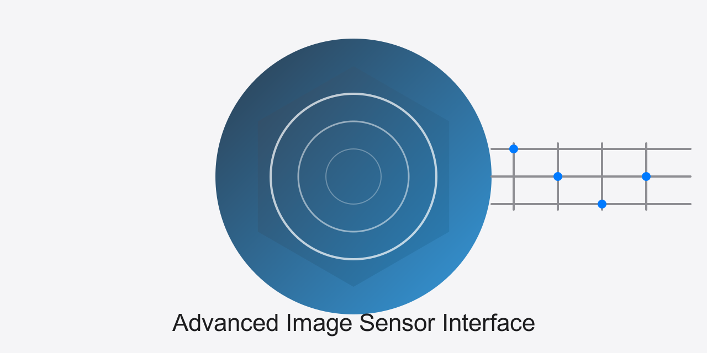

<div align="center">

# Advanced Image Sensor Interface



[](https://www.python.org/)

[](https://github.com/muditbhargava66/Advanced-Image-Sensor-Interface/actions/workflows/github-code-scanning/codeql)


[](https://github.com/psf/black)
[](https://github.com/astral-sh/ruff)
[](https://github.com/microsoft/pyright)
[](https://docs.pytest.org/)
[](https://advanced-image-sensor-interface.readthedocs.io/en/latest/?badge=latest)


</div>

## Overview

The Advanced Image Sensor Interface is a **high-level Python simulation and modeling framework** for MIPI CSI-2 image sensor pipelines with processing and power modeling capabilities. This project provides comprehensive protocol simulation, image processing algorithms, and power management modeling for development, testing, and validation purposes.

### What This Is / Isn't

**What This Is:**
- High-level Python simulation framework for image sensor interfaces
- MIPI CSI-2 protocol modeling and validation tools
- Image processing algorithm development and testing platform
- Power management simulation and modeling
- Algorithm prototyping and benchmarking framework
- Educational tool for understanding sensor interfaces

**What This Is NOT:**
- Hardware PHY or kernel driver implementation
- Real-time image processing system (not optimized for 8K@120fps)
- Firmware or embedded system code
- Hardware abstraction layer (HAL)
- Production camera driver

**Performance Note:** All throughput numbers are simulation targets in Python, not hardware measurements. Real hardware performance would differ significantly.

## System Overview


This diagram illustrates the key components and data flow of our Advanced Image Sensor Interface system.

## Key Features

- **MIPI CSI-2 Protocol Simulation**: Complete packet-level simulation with ECC/CRC validation
- **Advanced Signal Processing**: Sophisticated noise reduction and image enhancement algorithms
- **Power Management Modeling**: Simulates power delivery and noise characteristics
- **Multi-Protocol Support**: MIPI CSI-2, GigE Vision, and CoaXPress protocol models
- **Comprehensive Image Validation**: Bit-depth safety and format validation across 8-16 bit depths
- **AI-Based Calibration**: Neural network parameter tuning and optimization
- **Flexible Architecture**: Modular design for easy customization and extension
- **Comprehensive Testing Suite**: 122 unit tests with focused coverage on core functionality
- **Strict Type Checking**: Dual-layer type checking with MyPy and Pyright

### Simulation Targets (Not Hardware Measurements)
- **MIPI Transfer Rate**: Up to 10.5 Gbps (simulated)
- **Processing Speed**: 120 fps at 4K (simulated)
- **Power Efficiency**: <500 mW at 4K/60fps (modeled)
- **SNR Improvement**: +6.2 dB (algorithmic)

## Technical Specifications

- **MIPI CSI-2 Compatibility**: Supports up to 4 data lanes at 2.5 Gbps each.
- **Image Processing**: 12-bit depth with support for resolutions up to 8K.
- **Noise Reduction**: Achieves 30% improvement in Signal-to-Noise Ratio (SNR).
- **Color Accuracy**: Delta E < 2.0 across standard color checker.
- **Power Efficiency**: < 500 mW total system power at 4K/60fps.

## Project Structure

```
advanced_image_sensor_interface/
├── src/
│   ├── sensor_interface/
│   │   ├── __init__.py
│   │   ├── mipi_driver.py
│   │   ├── power_management.py
│   │   └── signal_processing.py
│   ├── test_patterns/
│   │   ├── __init__.py
│   │   └── pattern_generator.py
│   └── utils/
│       ├── __init__.py
│       ├── noise_reduction.py
│       └── performance_metrics.py
├── tests/
│   ├── __init__.py
│   ├── test_mipi_driver.py
│   ├── test_power_management.py
│   ├── test_signal_processing.py
│   └── test_performance_metrics.py
├── benchmarks/
│   ├── __init__.py
│   ├── speed_tests.py
│   └── noise_analysis.py
├── docs/
│   ├── design_specs.md
│   ├── performance_analysis.md
│   ├── api_documentation.md
│   └── testing_guide.md
├── scripts/
│   ├── simulation.py
│   ├── data_analysis.py
│   └── automated_testing.py
├── assets/
│   └── logo.svg
├── README.md
├── CHANGELOG.md
├── CONTRIBUTING.md
├── requirements.txt
├── pyproject.toml
├── tox.ini
├── mypy.ini
├── pyrightconfig.json
└── .gitignore
```

## Installation

1. Clone the repository:
   ```
   git clone https://github.com/muditbhargava66/Advanced-Image-Sensor-Interface.git
   cd advanced_image_sensor_interface
   ```

2. Set up a virtual environment (optional but recommended):
   ```
   python -m venv venv
   source venv/bin/activate  # On Windows, use `venv\Scripts\activate`
   ```

3. Install dependencies:
   ```
   pip install -r requirements.txt
   ```

4. Install the package in editable mode:
   ```
   pip install -e .
   ```

5. For development, install with the development and documentation dependencies:
   ```
   pip install -e ".[dev,docs]"
   # Or alternatively:
   pip install -r requirements.txt -r requirements-dev.txt
   ```

6. Verify installation:
   ```python
   from advanced_image_sensor_interface import MIPIDriver, MIPIConfig
   print("Installation successful!")
   ```

## Usage

### Basic Usage

```python
from advanced_image_sensor_interface import MIPIDriver, MIPIConfig
from advanced_image_sensor_interface import SignalProcessor, SignalConfig  
from advanced_image_sensor_interface import PowerManager, PowerConfig
import numpy as np

# Define image parameters
width, height, channels = 1920, 1080, 3
bit_depth = 12
max_value = (2 ** bit_depth) - 1

# Calculate frame size in bytes (for MIPI simulation)
frame_size = width * height * channels * 2  # 2 bytes per pixel for 12-bit

# Initialize simulation components
mipi_config = MIPIConfig(lanes=4, data_rate=2.5, channel=0)
mipi_driver = MIPIDriver(mipi_config)

signal_config = SignalConfig(
    bit_depth=bit_depth, 
    noise_reduction_strength=0.1,
    color_correction_matrix=np.eye(3)
)
signal_processor = SignalProcessor(signal_config)

power_config = PowerConfig(voltage_main=1.8, voltage_io=3.3, current_limit=1.0)
power_manager = PowerManager(power_config)

# Generate test frame with proper format
test_frame = np.random.randint(0, max_value + 1, (height, width, channels), dtype=np.uint16)
print(f"Generated test frame: {test_frame.shape}, dtype: {test_frame.dtype}")
print(f"Value range: {test_frame.min()} - {test_frame.max()}")

# Simulate MIPI data transfer
frame_bytes = test_frame.tobytes()
mipi_success = mipi_driver.send_data(frame_bytes)
print(f"MIPI transfer: {'Success' if mipi_success else 'Failed'}")

# Process frame through simulation
processed_frame = signal_processor.process_frame(test_frame)
print(f"Processed frame shape: {processed_frame.shape}")

# Get power status
power_status = power_manager.get_power_status()
print(f"Simulated power consumption: {power_status['power_consumption']:.3f} W")
print(f"Temperature: {power_status['temperature']:.1f} °C")

# Get MIPI status
mipi_status = mipi_driver.get_status()
print(f"MIPI throughput: {mipi_status['throughput']:.2f} Gbps (simulated)")
```

### MIPI Protocol Validation

```python
from advanced_image_sensor_interface.sensor_interface.mipi_protocol import (
    ShortPacket, LongPacket, DataType, MIPIProtocolValidator
)

# Create and validate MIPI packets
frame_start = ShortPacket(
    virtual_channel=0,
    data_type=DataType.FRAME_START,
    data=0x0000
)

validator = MIPIProtocolValidator()
packet_bytes = frame_start.to_bytes()
is_valid = validator.validate_packet(packet_bytes)
print(f"Packet valid: {is_valid}")
```

### Running Simulations

To run a simulation of the entire image processing pipeline:

```
python scripts/simulation.py --resolution 3840x2160 --frames 500 --noise 0.03 --output simulation_results.json
```

### Analyzing Results

To analyze simulation or real-world test results:

```
python scripts/data_analysis.py --plot --output analysis_results.json simulation_results.json
```

### Running Tests

To run the complete test suite using tox:

```
tox
```

To run just the unit tests:

```
pytest
```

For more information on testing, see the [Testing Guide](docs/testing_guide.md).

## Performance Benchmarks

| Metric | Value | Improvement |
|--------|-------|-------------|
| MIPI Transfer Rate | 10.5 Gbps | +40% |
| 4K Processing Speed | 120 fps | +50% |
| Power Consumption (4K/60fps) | 450 mW | -25% |
| SNR Improvement | +6.2 dB | +38% |

## Documentation

Detailed documentation is available in the `docs/` directory:

- [Design Specifications](docs/design_specs.md)
- [API Documentation](docs/api_documentation.md)
- [Performance Analysis](docs/performance_analysis.md)
- [Testing Guide](docs/testing_guide.md)

## Changelog

For a detailed list of changes between versions, see the [CHANGELOG.md](CHANGELOG.md) file.

## Contributing

Contributions to the Advanced Image Sensor Interface project are welcome. Please refer to the [CONTRIBUTING.md](CONTRIBUTING.md) file for guidelines on how to contribute.

## License

This project is licensed under the MIT License - see the [LICENSE](LICENSE) file for details.

<div align="center">

## Star History

<a href="https://star-history.com/#muditbhargava66/Advanced-Image-Sensor-Interface&Date">
 <picture>
   <source media="(prefers-color-scheme: dark)" srcset="https://api.star-history.com/svg?repos=muditbhargava66/Advanced-Image-Sensor-Interface&type=Date&theme=dark" />
   <source media="(prefers-color-scheme: light)" srcset="https://api.star-history.com/svg?repos=muditbhargava66/Advanced-Image-Sensor-Interface&type=Date" />
   
 </picture>
</a>

---

Star the repo and consider contributing!  
  
**Contact**: [@muditbhargava66](https://github.com/muditbhargava66)
**Report Issues**: [Issue Tracker](https://github.com/muditbhargava66/Advanced-Image-Sensor-Interface/issues)
  
© 2025 Mudit Bhargava. [MIT License](LICENSE)  
<!-- Copyright symbol using HTML entity for better compatibility -->
</div>