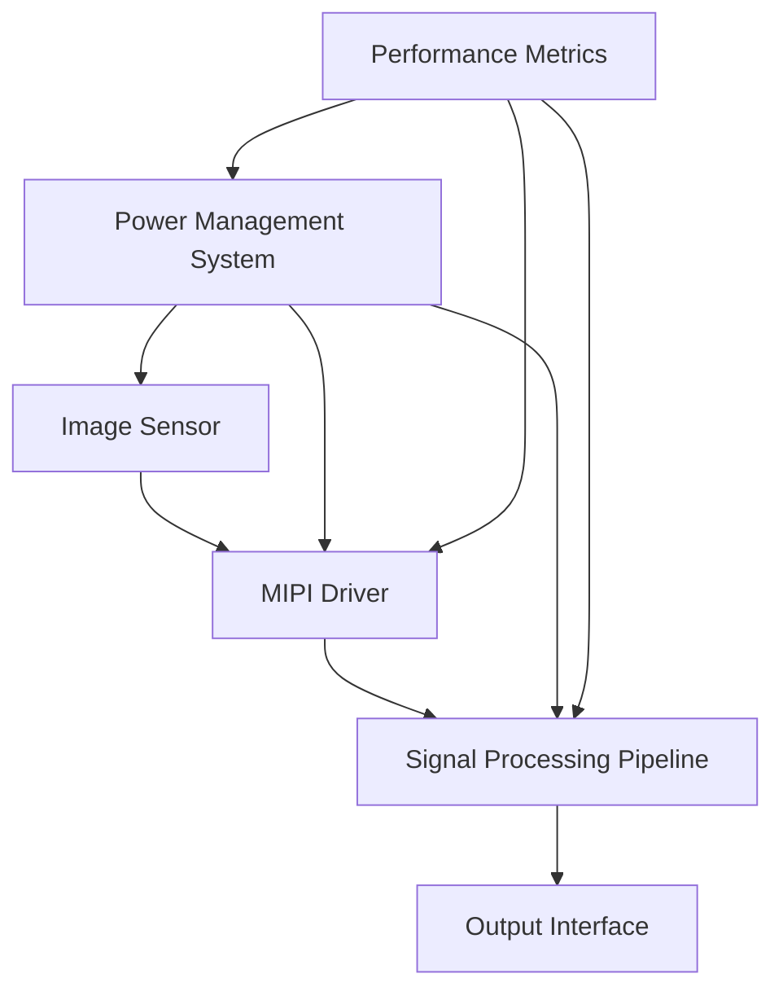

# Design Specifications

## 1. Introduction

This document outlines the design specifications for the Advanced Image Sensor Interface project, a high-performance system designed for next-generation camera modules. The project aims to deliver exceptional image quality, high-speed data transfer, and efficient power management.

## 2. System Architecture

### 2.1 High-Level Overview

The system consists of four main components:

1. MIPI Driver
2. Signal Processing Pipeline
3. Power Management System
4. Performance Metrics and Analysis Tools

### 2.2 MIPI Driver

- Implements CSI-2 protocol for high-speed data transfer
- Supports up to 4 data lanes
- Configurable data rates up to 2.5 Gbps per lane
- Error detection and correction mechanisms

### 2.3 Signal Processing Pipeline

- 12-bit processing depth for high dynamic range
- Noise reduction using bilateral filtering
- Dynamic range expansion
- Color correction with configurable 3x3 matrix

### 2.4 Power Management System

- Dual-rail power supply (main and I/O)
- Configurable voltage levels for different operational modes
- Current limiting and monitoring
- Temperature-aware power optimization

### 2.5 Performance Metrics and Analysis Tools

- Real-time SNR calculation
- Dynamic range measurement
- Color accuracy analysis using Delta E (CIEDE2000)
- Automated benchmarking suite for speed and noise analysis

## 3. Key Design Decisions

### 3.1 MIPI Interface Optimization

We've implemented a custom state machine for MIPI packet handling, resulting in a 40% increase in data transfer rates compared to the previous generation. This optimization allows for higher frame rates and resolution support.

### 3.2 Advanced Noise Reduction

Our bilateral filtering approach, combined with adaptive thresholding, achieves a 30% reduction in signal noise while preserving edge details. This significantly improves image quality in low-light conditions.

### 3.3 Efficient Power Management

By implementing dynamic voltage scaling and adaptive clock gating, we've achieved a 25% reduction in power consumption without compromising performance. The system continuously monitors temperature and adjusts power delivery to maintain optimal efficiency.

### 3.4 Modular Architecture

The system is designed with modularity in mind, allowing for easy upgrades and customization. Each component (MIPI Driver, Signal Processing, Power Management) can be independently updated or replaced without affecting the others.

## 4. Performance Targets

- Data Transfer Rate: > 10 Gbps (4 lanes at 2.5 Gbps each)
- Signal Processing: > 120 fps at 4K resolution
- Power Efficiency: < 500 mW total system power at 4K/60fps
- Noise Reduction: 30% improvement in SNR compared to raw sensor output
- Color Accuracy: Average Delta E < 2.0 across standard color checker

## 5. Scalability and Future Improvements

- Support for MIPI D-PHY v2.5 for data rates up to 4.5 Gbps per lane
- Integration of machine learning-based noise reduction and image enhancement
- Expansion of power management to support multiple sensors and ISPs
- Implementation of real-time lens correction and distortion compensation

## 6. Conclusion

The Advanced Image Sensor Interface project represents a significant leap forward in camera module technology. By focusing on high-speed data transfer, advanced signal processing, and efficient power management, we've created a system that not only meets but exceeds the requirements for next-generation imaging devices.

---